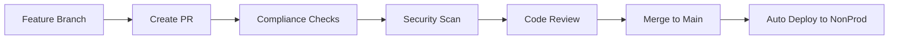
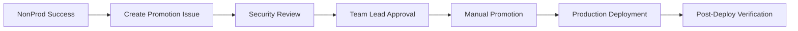

# WebApp Team - Deployment Guide
## ISO 27001/SOC 2/GDPR Compliant Application Deployment

This guide explains how to deploy applications using the compliant GitOps workflow that integrates with the organization's existing compliance infrastructure.

## 🏗️ Architecture Integration

This repository leverages the existing organization-level compliance controls:

### ✅ Already Provided by Organization
- **GitOps Infrastructure**: Workload Identity Federation with GitHub Actions
- **Audit Logging**: 7-year retention with comprehensive audit trails  
- **Organization Policies**: 30+ security policies enforced automatically
- **Zero-Standing-Privilege**: Read-only service accounts with PAM elevation
- **Security Monitoring**: Real-time alerts and BigQuery analysis

### 🎯 Tenant-Level Controls (This Repository)
- **Application-specific RBAC**: Scoped permissions within tenant namespace
- **Production approval gates**: Manual security review for production changes
- **Binary authorization**: Image scanning and attestation requirements
- **Environment-specific configs**: Compliant settings for nonprod/prod
- **Comprehensive auditing**: Application deployment audit trail

## 🚀 Deployment Workflows

### 1. Development Flow (Automatic)


**Process:**
1. Create feature branch and make changes
2. Open PR → Triggers compliance validation
3. Automated checks verify ISO 27001/SOC 2 requirements
4. Code review by team members (and security team if needed)
5. Merge to `main` → Automatic deployment to non-production

### 2. Production Flow (Manual Approval)


**Process:**
1. Successful non-prod deployment creates GitHub issue
2. Security team reviews and approves production change
3. Team lead confirms testing is complete
4. Use "Production Promotion" workflow with approval issue number
5. Automated production deployment with verification

## 📋 Compliance Controls

### ISO 27001 Controls Implemented
| Control | Implementation | Verification |
|---------|----------------|--------------|
| **A.12.1.2** Change Management | GitOps with PR reviews | GitHub audit trail |
| **A.9.4.1** Access Restriction | RBAC with namespace isolation | Kubernetes permissions |
| **A.12.4.1** Event Logging | Comprehensive audit logs | Cloud Logging |
| **A.12.6.1** Vulnerability Management | Container scanning | Binary authorization |

### SOC 2 Type II Controls Implemented  
| Control | Implementation | Verification |
|---------|----------------|--------------|
| **CC8.1** Change Control | Approval gates for production | GitHub issues + workflows |
| **CC6.1** Logical Access | Workload Identity + RBAC | IAM + Kubernetes |
| **CC6.6** Audit Logging | Complete deployment audit trail | Cloud Audit Logs |
| **CC7.2** System Monitoring | Real-time monitoring + alerts | Cloud Monitoring |

### GDPR Compliance (EU/Belgium)
- **Data Residency**: All resources in `europe-west1`
- **Data Protection by Design**: Security-first configuration
- **Audit Trail**: Complete logging for data processing activities
- **Access Controls**: Strict RBAC with minimal necessary permissions

## 🔧 Usage Examples

### Deploy to Non-Production
```bash
# Automatic - just merge to main
git checkout main
git pull origin main
# Deployment happens automatically via GitHub Actions
```

### Promote to Production
```bash
# 1. Find the successful non-production release
gcloud deploy releases list \
  --project=u2i-tenant-webapp \
  --region=europe-west1 \
  --delivery-pipeline=webapp-delivery-pipeline

# 2. Get approval issue number from GitHub

# 3. Use GitHub Actions workflow "Production Promotion"
# Inputs:
# - release_name: webapp-20231216-143052-abc1234
# - approval_issue: 42
# - emergency: false
```

### Emergency Production Deployment
```bash
# For critical security fixes or outages
# Use "Production Promotion" workflow with:
# - emergency: true
# Note: Additional post-deployment audit review required
```

## 🔍 Monitoring and Verification

### Check Deployment Status
```bash
# View all releases
gcloud deploy releases list \
  --project=u2i-tenant-webapp \
  --region=europe-west1 \
  --delivery-pipeline=webapp-delivery-pipeline

# Check specific rollout
gcloud deploy rollouts describe ROLLOUT_NAME \
  --project=u2i-tenant-webapp \
  --region=europe-west1 \
  --delivery-pipeline=webapp-delivery-pipeline \
  --release=RELEASE_NAME
```

### Verify Application Health
```bash
# Non-production
gcloud container clusters get-credentials nonprod-autopilot \
  --location=europe-west1 --project=u2i-gke-nonprod
kubectl get pods -n webapp-team

# Production  
gcloud container clusters get-credentials prod-autopilot \
  --location=europe-west1 --project=u2i-gke-prod
kubectl get pods -n webapp-team
```

### Access Application
```bash
# Port forward to test locally
kubectl port-forward -n webapp-team svc/webapp-service 8080:80

# Test endpoints
curl http://localhost:8080/
curl http://localhost:8080/health
curl http://localhost:8080/ready
```

## 🚨 Troubleshooting

### Common Issues

#### 1. Compliance Check Failures
```bash
# Check PR status in GitHub Actions
# Look for specific compliance validation errors
# Common fixes:
# - Add missing compliance labels
# - Update security contexts
# - Fix resource limits
```

#### 2. Image Pull Failures
```bash
# Verify Artifact Registry permissions
gcloud projects get-iam-policy u2i-tenant-webapp \
  --flatten="bindings[].members" \
  --filter="bindings.members:*compute@developer.gserviceaccount.com"
```

#### 3. Production Approval Issues
```bash
# Ensure GitHub issue has:
# - "security-approved" label, OR
# - Comment from security team with "approved"
# - Issue linked to production promotion workflow
```

## 📞 Support Contacts

- **Application Issues**: webapp-team@u2i.com
- **Security Questions**: security-team@u2i.com  
- **Platform Support**: platform-team@u2i.com
- **Compliance Issues**: compliance@u2i.com
- **Emergency**: Use emergency deployment option + notify on-call

## 📚 Additional Resources

- [Organization Compliance Guide](../gcp-org-compliance/README.md)
- [Shared GKE Documentation](../gcp-org-compliance/SHARED_GKE_TENANT_GUIDE.md)
- [ISO 27001 Controls Mapping](./docs/iso27001-controls.md)
- [SOC 2 Controls Mapping](./docs/soc2-controls.md)
- [GDPR Compliance Guide](./docs/gdpr-compliance.md)