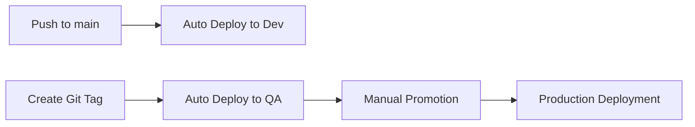

# Stage Deployment Guide

This guide explains the multi-stage deployment process for the webapp using Cloud Deploy.

## Deployment Flow



## Stage Details

### 1. Development (Dev)
- **Trigger**: Push to `main` branch
- **Automatic**: Yes
- **Approval**: None required
- **Namespace**: `webapp-dev`
- **Purpose**: Continuous integration testing

### 2. Quality Assurance (QA)
- **Trigger**: Git tags (v*.*.*)
- **Automatic**: Yes (on tag push)
- **Approval**: Auto-approved after render
- **Namespace**: `webapp-qa`
- **Purpose**: Release candidate testing

### 3. Production (Prod)
- **Trigger**: Manual promotion from QA
- **Automatic**: No
- **Approval**: Manual approval required
- **Namespace**: `webapp-prod`
- **Purpose**: Live production environment

## Deployment Commands

### Dev Deployment (Automatic)
```bash
# Happens automatically when you push to main
git push origin main
```

### QA Deployment (Tag-based)
```bash
# Create and push a semver tag
git tag v1.2.3 -m "Release v1.2.3"
git push origin v1.2.3
```

### Production Promotion
```bash
# Option 1: Using GitHub Actions
# Go to Actions → "CD - Stage Promotion"
# Select: from_stage=qa, to_stage=prod
# Provide release name and reason

# Option 2: Using gcloud CLI
gcloud deploy releases promote \
  --release=<RELEASE_NAME> \
  --delivery-pipeline=webapp-pipeline \
  --region=europe-west1 \
  --project=u2i-tenant-webapp \
  --to-target=prod-gke
```

## Check Deployment Status

### View All Releases
```bash
gcloud deploy releases list \
  --delivery-pipeline=webapp-pipeline \
  --region=europe-west1 \
  --project=u2i-tenant-webapp
```

### Check Specific Environment
```bash
# Dev
kubectl get pods -n webapp-dev

# QA
kubectl get pods -n webapp-qa

# Production (requires prod cluster access)
kubectl get pods -n webapp-prod
```

### Use Status Workflow
```bash
# Run the deployment status check
gh workflow run "CD - Deployment Status"

# Or check Actions tab for scheduled runs
```

## Important Notes

1. **No Dev→QA Promotion**: QA deployments are triggered by tags, not promotions
2. **Production Approval**: All production deployments require manual approval
3. **Serial Pipeline**: Releases must progress through stages in order
4. **Version Tags**: Use semantic versioning for tags (e.g., v1.2.3)

## Troubleshooting

### QA Deployment Not Triggering
- Ensure tag follows pattern: `v*.*.*`
- Check GitHub Actions for errors
- Verify tag was pushed: `git push origin <tag>`

### Production Promotion Failed
- Check if QA deployment succeeded first
- Verify you have approval permissions
- Check Cloud Console for pending approvals

### Rollback Procedure
1. Find previous successful release
2. Use promotion workflow with specific release name
3. Fast-track approval if emergency